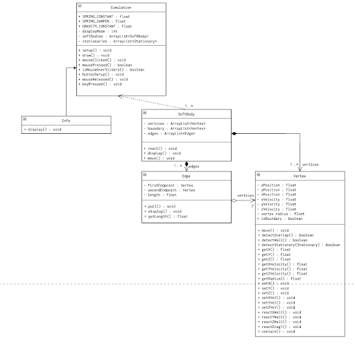

# 3D SoftBodySimulation

## Installation & System Requirements
controlP5 for GUI widget interaction

## Description
### Brief Synopsis
We aim to create a soft-body simulation that will be user-interactive. Currently, we plan to render the visual elements of our project within Processing, with a minimum viable product resembling a functional simulation of a soft 3D ball under the effect of gravity and other obstacles. Afterwards, the product will be expanded to encompass more interactive components such as simulation reactions to user mouse inputs, impact with other obstacles, as well as other combinations of collisions.  

### Extended description
This project focuses on the simulation and rendering of the behaviors observed in a 3-dimensional soft body. The body is composed of many vertices connected by springs. These vertices are laid out, in the beginning, in a rectangular lattice pattern contained inside of a sphere. For later display purposes, we identify the vertices close to the boundary of the body, aptly named boundary vertices, by an instance boolean in the vertex class. At each tick, the springs apply force to the vertices. This force is then converted into changes in velocity, which in turn changes the position of the vertices. The vertices are also subject to the force of gravity. When any vertex hits a wall, similar to the orb lab, it will reverse its velocity. The body will be displayed in P3D using small dots centered at each of the boundary vertices. Minimally, the project requires working initialization of vertices and edges, proper movement of the vertices according to physical laws, basic rendering of the object and interaction with the four walls of the screen. The project could be expanded to include interaction with other stationary objects or line segments in the frame of reference. We also, time permitting, could improve the appearance of the object by changing the display method: a skeleton of edges with shading or coloring User interaction could be added, allowing the user to pull the ball or change the physical constants that control the simulation.  

### Design Overview
There are six classes: Simulation, Stationary, SoftBody, Vertex, Edge, and Info. The Simulation creates a SoftBody. The SoftBody contains an ArrayList of vertices and an arrayList of edges. Each edge has its two vertex endpoints as instance variables. The vertices’ instance variables are affected by methods in the edge class. The Info class only stores the information for the info page in order to reduce clutter in the Simulation class.   

## Prototype Documentation:  
https://tinyurl.com/softBodySimulation  

## UML Diagrams
### Prototype UML Diagram  

### Final UML Diagram

