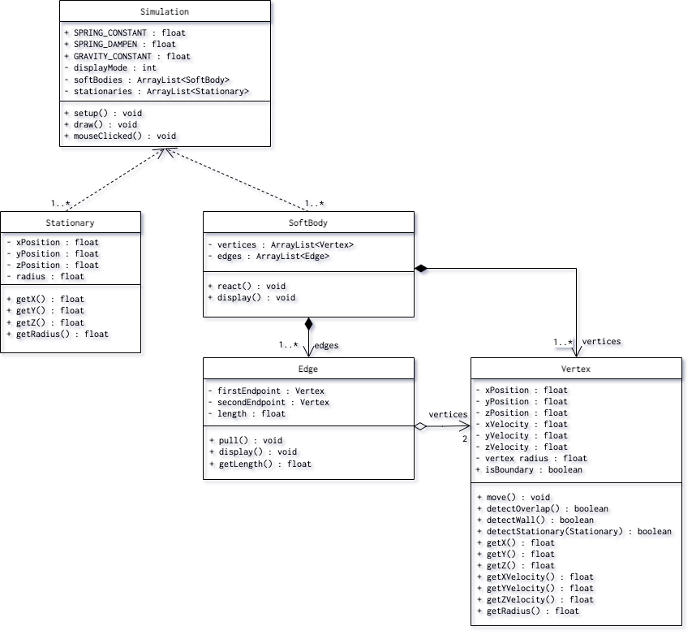

# SoftBodySimulation

## Installation & System Requirements
Required Library: controlP5 for GUI widget interaction

## Description
### Brief Synopsis
We aim to create a soft-body simulation that will be user-interactive. Currently, we plan to render the visual elements of our project within Processing, with a minimum viable product resembling a functional simulation of a soft 3D ball under the effect of gravity and other obstacles. Afterwards, the product will be expanded to encompass more interactive components such as simulation reactions to user mouse inputs, impact with other obstacles, as well as other combinations of collisions.   

## Prototype Doc:  
https://tinyurl.com/softBodySimulation  

## UML Diagrams
### Prototype UML Diagram  

### Final UML Diagram

